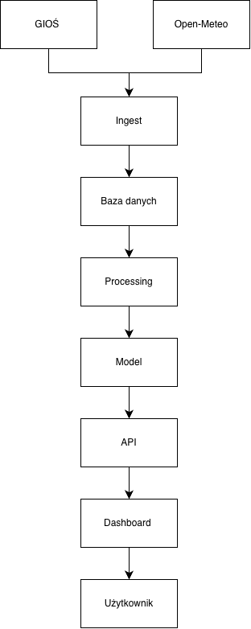

## 2. Schemat danych

System wykorzystuje następujące tabele:

### stations

Przechowuje informacje o stacjach pomiarowych.

| Kolumna | Typ / rola | Opis |
|---|---|---|
| `id` | PK | unikalny identyfikator stacji |
| `name` |  | nazwa stacji |
| `city` |  | miasto |
| `latitude` |  | szerokość geograficzna |
| `longitude` |  | długość geograficzna |

### sensors

Przechowuje informacje o sensorach przypisanych do stacji.

| Kolumna | Typ / rola | Opis |
|---|---|---|
| `id` | PK | unikalny identyfikator sensora |
| `station_id` | FK | identyfikator stacji |
| `param_code` |  | kod mierzonego parametru, np. `PM10`, `PM2.5` |

Relacja:

`stations.id -> sensors.station_id`

Jedna stacja może posiadać wiele sensorów.

### measurements

Przechowuje surowe pomiary jakości powietrza.

| Kolumna | Typ / rola | Opis |
|---|---|---|
| `id` | PK | unikalny identyfikator pomiaru |
| `sensor_id` | FK | identyfikator sensora |
| `timestamp` | UTC | czas wykonania pomiaru |
| `value` | nullable | wartość stężenia w µg/m³ |

Relacja:

`sensors.id -> measurements.sensor_id`

Dodatkowe ograniczenie:

`UNIQUE(sensor_id, timestamp)`

Oznacza to, że dla jednego sensora nie może istnieć więcej niż jeden pomiar dla tego samego momentu czasu.

Kolumna `value` jest nullable. Brak wartości oznacza brak pomiaru i nie może być automatycznie zastępowany wartością `0`.

### weather

Przechowuje dane pogodowe dla lokalizacji stacji.

| Kolumna | Typ / rola | Opis |
|---|---|---|
| `id` | PK | unikalny identyfikator rekordu pogodowego |
| `station_id` | FK | identyfikator stacji |
| `timestamp` |  | czas pomiaru pogodowego |
| `temp_c` |  | temperatura w °C |
| `wind_ms` |  | prędkość wiatru w m/s |
| `humidity` |  | wilgotność |
| `pressure_hpa` |  | ciśnienie w hPa |
| `precip_mm` |  | opad w mm |

Relacja:

`stations.id -> weather.station_id`

Dane pogodowe są przypisywane do tej samej lokalizacji co pomiary jakości powietrza.

### daily_measurements

Przechowuje dobowe agregaty pomiarów.

| Kolumna | Opis |
|---|---|
| `station_id` | identyfikator stacji |
| `param_code` | parametr, np. PM10 lub PM2.5 |
| `date` | dzień |
| `mean_value` | średnia dobowa |
| `max_value` | maksymalna wartość dobowa |
| `coverage` | stopień pokrycia danych w danym dniu |

Tabela powstaje na etapie przetwarzania danych i jest wykorzystywana m.in. do budowy cech oraz modelowania.

### predictions

Przechowuje prognozy wygenerowane przez model.

| Kolumna | Typ / rola | Opis |
|---|---|---|
| `id` | PK | unikalny identyfikator prognozy |
| `station_id` | FK | identyfikator stacji |
| `param_code` |  | prognozowany parametr |
| `target_date` |  | dzień, którego dotyczy prognoza |
| `predicted_value` |  | przewidywane stężenie |
| `model_version` |  | wersja modelu |
| `created_at` |  | czas utworzenia prognozy |

Relacja:

`stations.id -> predictions.station_id`


### Relacje między tabelami

```text
stations
   │
   ├──< sensors
   │      │
   │      └──< measurements
   │
   ├──< weather
   │
   ├──< daily_measurements
   │
   └──< predictions
   ```


## 3. Kontrakt API

API zostało zaprojektowane od strony potrzeb dashboardu.
Dashboard powinien umożliwiać wybór stacji, podgląd ostatnich pomiarów,
podstawowych danych pogodowych oraz prognozy PM10 i PM2.5.

### GET /stations

Zwraca listę stacji dostępnych w aplikacji.

Metoda:

`GET`

Parametry:

Brak.

Przykładowe zapytanie:

`GET /stations`

Przykładowa odpowiedź:

```json
[
  {
    "id": 814,
    "name": "Katowice, ul. Kossutha",
    "city": "Katowice",
    "latitude": 50.2649,
    "longitude": 19.0238
  },
  {
    "id": 400,
    "name": "Kraków",
    "city": "Kraków",
    "latitude": 50.0647,
    "longitude": 19.945
  }
]


## 4. Przepływ danych

